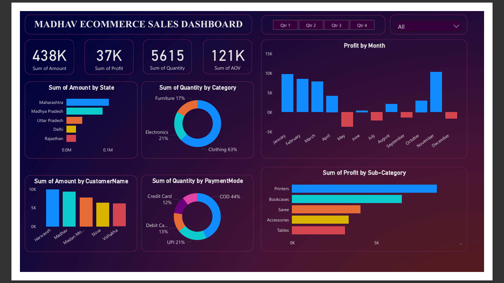

# Madhav Ecommerce Power BI Dashboard

An interactive Power BI dashboard built to analyze sales data from a fictional ecommerce company, **Madhav Ecommerce**. The project visualizes key business metrics such as total sales, profit, order quantity, and customer distribution across cities and states.



---

### 📝 Project Summary

This project focuses on creating a user-friendly, interactive dashboard using Power BI to provide actionable insights into sales and customer behavior. It empowers stakeholders to make data-driven decisions by visualizing sales trends, customer demographics, and product performance over time.

---

## 📌 Objective

The goal of this project is to build a dynamic and interactive dashboard using Power BI that provides meaningful insights into sales, customer behavior, and product performance based on ecommerce data.

---

## 🛠️ Tools & Technologies

- Power BI Desktop: For creating the interactive dashboard.
- DAX (Data Analysis Expressions): For data modeling and calculations within Power BI.
- Power Query: For data transformation and cleaning.
- CSV Files: As the data format for importing order and transactional data.

---

## 📊 Dashboard Features

- **KPIs**:  
  - Total Sales  
  - Total Profit  
  - Total Quantity Sold  
  - Average Order Value  

- **Charts**:  
  - Total Sales by State (Map View)  
  - Quantity Sold by Category  
  - Top 5 Customers by Total Amount  
  - Quantity Sold by Payment Mode  
  - Monthly Profit Trend  
  - Profit by Sub-Category  

- **Filters & Slicers**:  
  - Quarter  
  - State  

---

## 🗂️ Project Structure

```plaintext
Madhav-Ecommerce-Powerbi-Dashboard/
│
├── data/
│   ├── Details.csv
│   └── Orders.csv
│
├── dashboard/
│   └── Madhav_Ecommerce_Dashboard.pbix
│
├── assets/
│   └── dashboard-screenshot.png
│
└── README.md
```

---

## 📁 Datasets

### 🔹 Details.csv  
Contains transaction-level data including:
- Order ID  
- Amount  
- Profit  
- Quantity  
- Category  
- Sub-Category  
- Payment Mode  

### 🔹 Orders.csv  
Contains order metadata including:
- Order ID  
- Order Date  
- Customer Name  
- State  
- City  

---

## 🚀 How to Use

1. Clone the repository:
   ```bash
   git clone https://github.com/Mandar-Tannu/Madhav-Ecommerce-Powerbi-Dashboard.git
   ```

---

## ⚠️ Challenges Faced

- Handling inconsistent data formats in source CSV files that required cleaning and transformation using Power Query.
- Creating accurate relationships between datasets to ensure correct aggregation and filtering of KPIs.
- Designing an intuitive dashboard layout that balances detail and simplicity for end-user engagement.

---

## 🔮 Future Improvements
- Integrate real-time data refresh capabilities to keep the dashboard up-to-date automatically.
- Add more granular time-based filters such as monthly and weekly views for detailed trend analysis.
- Implement advanced forecasting and predictive analytics using Power BI AI features.
- Expand geographic analysis by including city-level maps and customer segmentation.
- Incorporate additional datasets like product reviews or customer feedback to enrich insights.

---

## 🧠 My Learning Journey

- This project provided hands-on experience with advanced Power BI features, including:
  - **Data Transformation**: Using Power Query to clean and transform raw data into a structured format.
  - **Data Modeling**: Creating relationships between tables and defining calculated columns using DAX.
  - **Data Visualization**: Designing interactive reports with various charts and KPIs.
  - **User Interaction**: Implementing filters and slicers to allow users to explore data dynamically.

---

## 📬 Contact

Created by Mandar Tannu  
Email: mandartannu19@gmail.com  
LinkedIn: https://www.linkedin.com/in/mandartannu/
